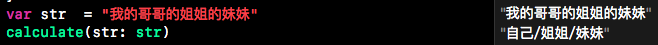

# relationship 

###亲戚关系计算器
例如： 

我的爸爸的爸爸 = 爷爷

我的哥哥的姐姐的妹妹 = 自己/姐姐/妹妹

```
var str  = "我的哥哥的姐姐的妹妹"
calculate(str: str)
```


#### 算法实现
##### 需求
1. 计算亲戚关系链得出我应该怎么称呼的结果
2. 反转结果得出他应该怎么称呼我的结果

##### 数据定义
1. 定义关系字符和修饰符

	```
 	【关系】f:父,m:母,h:夫,w:妻,s:子,d:女,xb:兄弟,ob:兄,lb:弟,xs:姐妹,os:姐,ls:妹
 
 	【修饰符】 &o:年长,&l:年幼,#:隔断,[a|b]:并列
 	 ``` 
2. 关系对应数据集合、关系过滤数据集合（data.json 和 filter.json）
 
	```
	// data.json
	{
	"f,f": [
    "爷爷",
    "祖父",
    "阿爷",
    "奶爷",
    "阿公"
  	],}
  	
  	// filter.json
  	{
     "exp": "m,h",
     "str": "f"
     },
     {
     "exp": "f,w",
     "str": "m"
     },
	```
解释下 filter 数据集的用途，比如 m,h 是我的妈妈的丈夫就是爸爸，也就是 f。 filter 的作用是去重和简化，需要把 exp 用 str 进行替换。

#####  算法实现
######  需求一
首选我们会列举几种亲戚关系和结果来分析，例如：

```
我的爸爸 = 爸爸，

我的哥哥的弟弟 = 自己/弟弟/哥哥，

我的哥哥的丈夫 = error。
```
额，不好意思我们国家暂时不支持同性婚姻，所以暂时不支持同性婚姻称呼查询。现在要分析上面的例子了，三种结果：1 ，单结果 2. 多结果 3. 错误提示 ，那么我们的算法要兼容以上三种情况，下面我们一步一步来实现。（下面方法只是概念，具体实现请查看代码，如果有疑问请在 issues 中提出。）

1. 定义方法 transform 把“我的爸爸”转化成 ",f" ,每层关系我们用","隔开，前面多一个"," 表示"我"自身。
2. 定义方法 filterSelectors 把 ",f" 转化成 "f",
3. 定义方法 dataValueByKeys 把 "f" 转化成 "爸爸"

```
func calculate(str:String) -> String {
    var result = String()
    let keys = transform(str: str)
    var filterHelper = FilteHelper(keys!)
    filterHelper.filterSelectors()
    result = dataValueByKeys(result: filterHelper.result)!
    return result
}
```
第一种情况单结果已经实现了，那么第二种多结果怎么办？我们试着用代码输出下 transform 和 filter 方法结果。

```
,ob,lb
,ob,lb
...
,ob,lb
#,xb
```
transform 的结果 ",ob,lb" 经过 filter 成了 "#,xb",根据我们数据的定义 # 是隔断符，所以分割后的值为 ",xb"和 "",空值是自己不用再进行 filter，其他的需要循环执行 filter 直到结果不在出现 # 并且结果与 filter 前的值相同为止。这点看起来有点绕，请看下面完整的输出帮助理解。

```
,ob,lb
,ob,lb
...
,ob,lb
#,xb
,xb
...
,xb
,ob#,lb
,ob
...
,ob
,ob
,ob
,lb
...
,lb
,lb
```
那么最后结果是 ["","ob","lb"],通过 dataValueByKeys 可以转化成 “自己/哥哥/弟弟”。第二种情况多结果也实现了，那么第三种情况错误情况如何实现呢？

`错误情况这里暂时偷个懒，后面实现再添加上`

###### 需求二

反转关系链我们需要一个反转的数据集，把 "f" 替换成 "[s|d]" 等等，数据集如下：

```
let reverseData:[String:String] = [
        "f":"[s|d]",
        "m":"[s|d]",
        "h":"w",
        "w":"h",
        "s":"[f|m]",
        "d":"[f|m]",
        "lb":"[os|ob]",
        "ob":"[ls|lb]",
        "xb":"[xs|xb]",
        "ls":"[os|ob]",
        "os":"[ls|lb]",
        "xs":"[xs|xb]",
    ]

```

定义方法 reverseKey 把 transform 后的内容进行反转替换，然后调用 filter 过滤，最后再通过 dataValueByKeys 得出结果。


 


